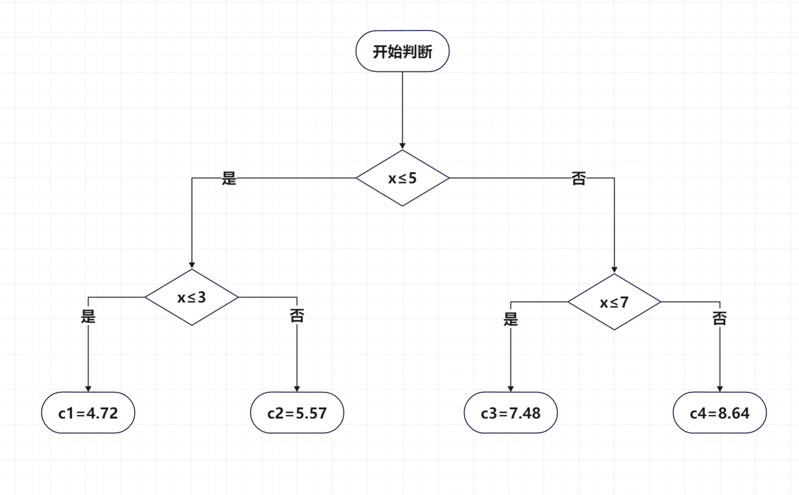

# 第一题：基于朴素贝叶斯的分类器
导入数据：
```{r echo=TRUE, message=FALSE, results='hide'}
library(readr)
data <- read_table("D:/大三上学习资料/统计（机器）学习/hw5/第一题数据.txt", col_names = FALSE)

data = as.matrix(data)
data = t(data)
colnames(data) = c('X1','X2','Y')

X1 = as.numeric(data[,1])
X2 = data[,2]
Y = as.numeric(data[,3])
```

## 基于极大似然估计
计算先验概率的极大似然估计
```{r}
PY = table(Y)/length(Y)
print(PY)
```

即$P(Y=-1)=0.333,\, P(Y=1)=0.667$。


计算条件概率的**极大似然估计**如下：
```{r}
## X1的条件概率的MLE
PX1.cond = matrix(rep(0,2*3),nrow=2)
colnames(PX1.cond) = c('1','2','3')
rownames(PX1.cond) = c('-1','1')
for(i in 1:2){
  for(j in 1:3){
  PX1.cond[i,j] = sum((X1==j) * (Y==round(2*i-3)))/sum(Y==2*i-3)
  }}
print(PX1.cond)
```

得到$x_1$的基于极大似然估计的条件概率为：
\begin{align*}
& P(x_1 = 1|Y=-1) = 0.2 \quad P(x_1 = 2|Y=-1) = 0.6 \quad P(x_1 = 3|Y=-1) = 0.2 \\
& P(x_1 = 1|Y=1) = 0.3 \quad P(x_1 = 2|Y=1) = 0.2 \quad P(x_1 = 3|Y=1) = 0.5 
\end{align*}

```{r}
# 计算X2的条件概率MLE
PX2.cond = matrix(rep(0,2*3),nrow=2)
X2.type = c('S','M','L')
colnames(PX2.cond) = X2.type
rownames(PX2.cond) = c('-1','1')
for(i in 1:2){
  for(j in 1:3){
    PX2.cond[i,j] = sum((X2==X2.type[j]) * (Y==round(2*i-3)))/sum(Y==2*i-3)
  }}
print(PX2.cond)
```

得到$x_2$的基于极大似然估计的条件概率如下
\begin{align*}
& P(x_2 = S|Y=-1) = 0.2 \quad P(x_2 = M|Y=-1) = 0.4 \quad P(x_2 = L|Y=-1) = 0.4 \\
& P(x_2 = S|Y=1) = 0.3 \quad P(x_2 = M|Y=1) = 0.3 \quad P(x_2 = L|Y=1) = 0.4 
\end{align*}

计算后验概率，并选择使得后验概率最大化的Y的取值
```{r}
# 计算x = (2, M)' 的类标记，不考虑共同的分母部分
## 对于Y = -1
p_neg1 = PY[1]*PX1.cond[1,2]*PX2.cond[1,2]
print(p_neg1) # 0.08
## 对于Y = 1
p_pos1 = PY[2]*PX1.cond[2,2]*PX2.cond[2.2]
print(p_pos1) # 0.04

```

因此
\begin{align*}
P(Y=1|x=(2,M)^T) < P(Y=-1|x=(2,M)^T)
\end{align*}

基于极大似然估计，可以得到类标记为$Y = -1$.

## 基于贝叶斯估计
计算基于贝叶斯估计的条件概率，以下统一取$\lambda = 1$。
```{r}
PX1.Bayes = matrix(rep(0,2*3),nrow=2)
colnames(PX1.Bayes) = c('1','2','3')
rownames(PX1.Bayes) = c('-1','1')
for(i in 1:2){
  for(j in 1:3){
    PX1.Bayes[i,j] = (sum((X1==j) * (Y==round(2*i-3)))+1)/(sum(Y==2*i-3)+3)
  }}
print(PX1.Bayes)
```

得到$x_1$的基于贝叶斯估计的条件概率为：
\begin{align*}
& P(x_1 = 1|Y=-1) = 0.25 \quad P(x_1 = 2|Y=-1) = 0.5 \quad P(x_1 = 3|Y=-1) = 0.25 \\
& P(x_1 = 1|Y=1) = 0.3076923 \quad P(x_1 = 2|Y=1) = 0.2307692 \quad P(x_1 = 3|Y=1) = 0.4615385 
\end{align*}


计算X2的基于贝叶斯估计的条件概率
```{r}
PX2.Bayes = matrix(rep(0,2*3),nrow=2)
X2.type = c('S','M','L')
colnames(PX2.Bayes) = X2.type
rownames(PX2.Bayes) = c('-1','1')
for(i in 1:2){
  for(j in 1:3){
    PX2.Bayes[i,j] = (sum((X2==X2.type[j]) * (Y==round(2*i-3))) +1)/(sum(Y==2*i-3)+3)
  }}
print(PX2.Bayes)
```

得到$x_2$的基于贝叶斯估计的条件概率如下
\begin{align*}
& P(x_2 = S|Y=-1) = 0.25 \quad P(x_2 = M|Y=-1) = 0.375 \quad P(x_2 = L|Y=-1) = 0.375 \\
& P(x_2 = S|Y=1) = 0.3076923 \quad P(x_2 = M|Y=1) = 0.3076923 \quad P(x_2 = L|Y=1) = 0.3846154
\end{align*}

计算后验概率，并选择使得后验概率最大化的Y的取值
```{r}
# 计算x = (2, M)' 的类标记
## 对于Y = -1
p_neg1 = PY[1]*PX1.Bayes[1,2]*PX2.Bayes[1,2]
print(p_neg1) # 0.0625
## 对于Y = 1 
p_pos1 = PY[2]*PX1.Bayes[2,2]*PX2.Bayes[2.2]
print(p_pos1)# 0.04733728 
## 结论：Y = -1
```

由于
\begin{align*}
P(Y=1|x=(2,M)^T) < P(Y=-1|x=(2,M)^T)
\end{align*}
基于贝叶斯估计，得到类标记为$Y = -1$.


# 第二题：利用信息增益比算法生成决策树
## 准备工作：计算熵、条件熵、信息增益和信息增益比的辅助函数
```{r}
# 将列名转换为列索引的函数
NameToCol <- function(colName){
  if (colName == '年龄'){
    return(2)
  }
  if(colName == '工作'){
    return(3)
  }
  if(colName == '房子'){
    return(4)
  }
  if(colName =='信贷情况'){
    return(5)
  }
  if(colName == '贷款审批'){
    return(6)
  }
}

# 计算熵的函数，data是数据集，C是分类指标（因变量）
H <- function(data,C){
  col.index = NameToCol(C)
  S = nrow(data)
  p = table(data[,col.index])/S
  # print(sum(-p*log(p)))
  return(sum(-p*log2(p)))
}

# 计算条件熵的函数，data是数据集，C是分类指标，A是特征
H.cond <- function(data,C,A){
  S = nrow(data)
  A.index = NameToCol(A)
  H = 0
  chara = unique(data[,A.index])
  for( i in 1:dim(chara)[1]){
   x = chara[i,1]
   x = as.character(x)
   sub = data[(data[,A.index]==x),]  # 以特征A对data进行分类
   portion = nrow(sub) /S  # 该子类的占比
   H = H + portion*H(sub,C) 
  }
  return(H)
}

# 计算信息增益的函数，data是数据集，C是分类指标，A是特征
g <- function(data,C,A){
  gCA = H(data,C) - H.cond(data,C,A)
  return(gCA)
}

# 计算信息增益比的函数，data是数据集，C是分类指标，A是特征
g.R <- function(data,C,A){
  gr = g(data,C,A)/H(data,A)
  print(gr)
  return(gr)
}
```

## 导入数据
```{r,message=FALSE,results='hide'}
library(readxl)
data <- read_excel("第二题数据.xlsx")
```

## 生成第一层节点
分别计算各个特征的信息增益比
```{r,results='hide'}
A1 = '年龄'
A2 = '工作'
A3 = '房子'
A4 = '信贷情况'
C = '贷款审批'
gR1 = g.R(data,C,A1) # 0.0523719
gR2 = g.R(data,C,A2) # 0.3524465
gR3 = g.R(data,C,A3) # 0.4325381
gR4 = g.R(data,C,A4) # 0.2318539
```

A3指标的信息增益比最大，因此用A3(房子)作为第一层的分类特征
```{r}
data.1 = subset(data,data$房子=='是') 
data.2 = subset(data,data$房子=='否')
```

查看两个子集
```{r}
print(data.1)
print(data.2)
```
注意到A3指标为“是”的子集的贷款审批结果都是“是”，则该子集可以结束迭代。另一个子集需要继续进行分裂。

## 生成第二层节点，并结束迭代
```{r,results='hide'}
# data.1中只有一类（贷款审批结果为“是”），data.1结束迭代
# 继续对data.2进行迭代，计算A1,A2,A4的信息增益比
gR1 = g.R(data.2,C,A1) # 0.1644105
gR2 = g.R(data.2,C,A2) # 1
gR4 = g.R(data.2,C,A4) # 0.3403745
```


特征A2的信息增益比最大，因此用A2(工作)作为第二次分裂的特征
```{r}
data.2.1 = subset(data.2, data.2$工作=='是')
data.2.2 = subset(data.2, data.2$工作=='否')
```

查看两个子集：
```{r}
print(data.2.1)
print(data.2.2)
```

可以看到，两个子集的贷款审批结果分别为“是”和“否”，则不再进行分裂，结束迭代，决策树构建完成。

## 决策树示意图

```{r, echo=T, fig.cap="决策树示意图", fig.show='asis',out.width = '35%',fig.align='center'}

```

<!-- {width=20%,height=20%} -->


# 第三题：用平方损失准则生成一个二叉回归树

## 导入数据
```{r,echo=T, message=FALSE,results='hide'}
library(readxl)
data <- read_excel("第三题数据.xlsx", col_names = FALSE)
data = t(data)
colnames(data) = c('x','y')
data = as.data.frame(data)
```

## 设定停止迭代的准则
若在某个节点$R_m$上，平方损失函数
\[L(R_m)=\sum_{i:\, x_i\in R_m}(y_i-\bar{y})^2 <\varepsilon\]
则停止对该节点的分裂。在本次实验中，我们设定$\varepsilon=0.5$

```{r}
epsilon = 0.5
```


## 准备工作：用于计算切分点的函数
```{r}
split <- function(data,i,j,epsilon){ # i是左侧下标，j是右侧下标，epsilon是迭代停止界值
  if(i==j){ # 如果数据集已经不可再分
    return(NULL)
  }
  L = sum((data[i:j,]$y-mean(data[i:j,]$y))^2)
  if(L<epsilon){ # 如果数据集的损失函数已经足够小
    return(NULL)
  }
  minL = Inf
  minK = i
  # 寻找该子集的最佳切分点
  for(k in seq(i,j-1)){
    # 切分，得到两个子集
    sub1 = data[i:k,]
    sub2 = data[(k+1):j,]
    # 计算平方损失函数L
    L = sum((sub1$y-mean(sub1$y))^2) + sum((sub2$y-mean(sub2$y))^2) 
    if( L<minL ){
      minL = L
      minK = k
    }
  }
  return(minK) # 返回最优的切分点
}

```


## 第一次切分
```{r}
# 第一层的分界点
k.1 = split(data,1,10,epsilon)
print(k.1) # 5
```

将数据集按照$x\le5$ 和 $x>5$拆成两个部分，可以使平方损失最小。对这两个部分继续进行分裂。

## 第二次切分，迭代停止
```{r}
# 第二层的分界点
k.2.1 = split(data,1,5,epsilon)
k.2.2 = split(data,6,10,epsilon)
print(c(k.2.1,k.2.2)) # 3,7
```

将第一个部分又按照$1\le x \le 3$和$3<x\le 5$拆成两个子节点；将第二个部分按照$5< x \le 7$和$7<x \le 10$再拆成两个节点。

下面，尝试对第三层节点再次拆分

```{r}
# 第三层的分界点
k.3.1 = split(data,1,3,epsilon)
k.3.2 = split(data,4,5,epsilon)
k.3.3 = split(data,6,7,epsilon)
k.3.4 = split(data,8,10,epsilon)
print(c(k.3.1,k.3.2,k.3.3,k.3.4)) # 全都是NULL
```

发现第三层每个叶子节点的损失函数都小于临界值$\varepsilon$，不需要继续拆分，则停止迭代。

## 每个划分的预测值
每个划分的输出值为该划分中所有样本的平均值，那么，上述四个类别的划分的输出值分别为：
```{r}
c1 = mean(data$y[1:3])
c2 = mean(data$y[4:5])
c3 = mean(data$y[6:7])
c4 = mean(data$y[8:10])
print(rbind(c('c1','c2','c3','c4'),c(c1,c2,c3,c4)))
```


## 二叉回归树示意图

```{r, echo=T, fig.cap="回归树示意图",  fig.show='asis',out.width = '50%',fig.align='center'}
 
```

<!-- {width=20%,height=20%} -->


# 第四题：证明Cart剪枝过程中$\alpha_k$单调递增
## 第$k$步的情况
在第$k$步中，设
\[
\alpha_k = \mathop{\min}_{t\,\in \,\mathcal{M}_k} g_k(t) = g_k(a)
\]
其中
\[
g_k(t) = \frac{C(t)-C(T_t)}{|T_t|-1}
\]

$C(t)$表示以节点$t$为单节点的预测误差，$C(t)$不随以$t$为根节点的子树的剪枝而发生变化。$C(T_t)=\sum_{\tau \in T_t} N_\tau H_\tau$，其中$\tau$是以$t$为根节点的子树的叶节点，$N_\tau$是叶节点$\tau$的样本数，$H_\tau$是$\tau$节点的熵。$|T_t|$是以$t$为根节点的子树的所有叶子节点的个数。

注意到在第$k$步中，$\alpha_k = \frac{C(a)-C(T_a)}{|T_a|-1}$，且由于满足剪枝条件的节点是唯一的，则对于任意不为$a$的内部节点$t$，都成立$g_k(t)>\alpha_k,\,t\ne a$.

## 第$k+1$步的情况
剪枝后，对于$\forall t \in \mathcal{M}_{k+1}$，若$t$不是$a$的祖先节点，也即以$t$为根节点的子树不包含$a$，则仍然有$g_{k+1}(t) = g_k(t)>\alpha_k$.

若$t$是$a$的祖先节点，则以$t$为根节点的子树的预测误差增加了$C(a)-C(T_a)$，叶子节点数量减少了$|T_a|-1$。我们可以得到：

\begin{align*}
g_{k+1}(t) &= \frac{C^{(k+1)} (t) - C^{(k+1)}(T_t)}{|T_t^{(k+1)}|-1} \\
&= \frac{C(t) - C(T_t) - [ C(a)-C(T_a)]}{|T_t|-1 - (|T_a|-1)}\\
\end{align*}

由于
\[
g_k(t) = \frac{C(t)-C(T_t)}{|T_t|-1} > \alpha_k
\]

并且
\begin{align*}
 \quad C(a)-C(T_a) = \alpha_k \,\left(|T_a|-1\right) 
\end{align*}

则有如下等价关系：
\begin{align*}
 &\quad \frac{C(t) - C(T_t) - [ C(a)-C(T_a)]}{|T_t|-1 - (|T_a|-1)} > \alpha_k \\
 &\Leftrightarrow  C(t) - C(T_t) - [ C(a)-C(T_a)] > \alpha_k [|T_t|-1 -(|T_a|-1)] \\
 & \Leftrightarrow   C(t) - C(T_t) > \alpha_k (|T_t|-1) \\
 & \Leftrightarrow \frac{C(t)-C(T_t)}{|T_t|-1} > \alpha_k
\end{align*}

在第$k+1$步时，$\forall t \in \mathcal{M}_{k+1},\,g_{k+1}(t)>\alpha_k$，因此，也有

\begin{equation*}
\alpha_{k+1}= \min_{t  \in  \mathcal{M}_{k+1}}g_{k+1}(t) > \alpha_k 
\end{equation*}

证毕

